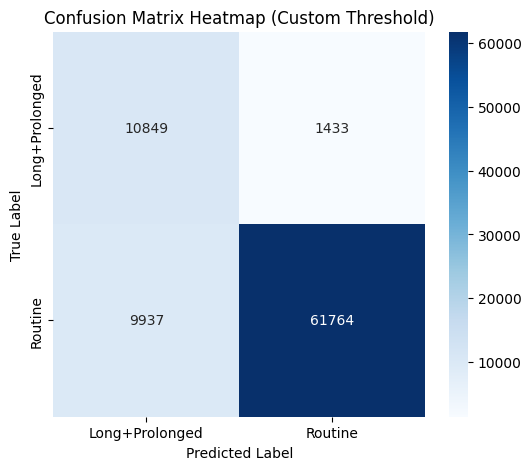

# **Grid Disruption Simulation, Risk Classification & Customer Impact Analytics**

> Predict. Simulate. Prioritise. Actionable analytics for grid resilience.
---
<h3 align="center">
  
</h3>

## Table of Contents
1. [Summary](#1-summary)  
2. [Problem Statement](#2-problem-statement)  
3. [Who This Helps](#3-who-this-helps)  
4. [Data Sources](#4-data-sources)  
5. [Methodology Overview](#5-methodology-overview)  
   - [5.1 Exploratory & Spatial Analysis](#51-exploratory--spatial-analysis)  
   - [5.2 Predictive Modelling: Outage Duration & Restoration Time Prediction](#52-predictive-modelling-outage-duration--restoration-time-prediction) 
   - [5.3 Predictive Modelling: Maximum Customers Impacted Prediction](#53-predictive-modelling-maximum-customers-impacted-prediction)  
   - [5.4 Scenario Simulation & Uncertainty Quantification](#54-scenario-simulation--uncertainty-quantification)  
6. [Recommendations & Conclusion](#6-recommendations-conclusion)  

---

## **Summary**
This repository delivers an end-to-end analytical pipeline to:
- **Simulate electrical grid disruptions** under different scenarios.
- **Classify outages by risk** for proactive prioritisation.
- **Predict customer impact & outage duration** using machine learning.
- **Quantify uncertainty** to support robust resilience planning.

The project integrates geospatial analysis, rare-event modelling, and scenario-based simulations to turn historical outage data into actionable intelligence.

---

## **Problem Statement**
Electrical grids are increasingly vulnerable to extreme weather, aging infrastructure, and emerging threats such as cyberattacks.  
A single fault can cascade into large-scale outages, causing safety risks, economic loss, and regulatory breaches.  
Without predictive tools to identify and prepare for high-impact events, utilities risk:
- Misallocating resources.
- Missing critical incidents.
- Falling short of resilience mandates.

---

## **Who This Helps**
- **Utility planners** : Identify weak points and prioritise upgrades.  
- **Regulators** : Verify resilience and compliance with standards.  
- **Emergency response teams** : Target high-risk zones for faster restoration.  
- **Policy-makers & investors** : Direct funding where it prevents the largest losses.

---

## **Data Sources**
1. **[EAGLE-I Power Outage Dataset (2014–2023)](https://figshare.com/articles/dataset/The_Environment_for_Analysis_of_Geoocated_Energy_Information_s_Recorded_Electricity_Outages_2014-2022/24237376)**  
   County-level outage data at 15-min resolution, 146M+ customer records.
2. **[DOE-417 Electric Disturbance Reports](https://www.eia.gov/electricity/data/disturbance/disturb_events_archive.html)**  
   Major disturbance records with event type attribution.
3. **[US Census County Population Estimates](https://www.census.gov/data/tables/time-series/demo/popest/2020s-counties-total.html)**  
   Context for outage severity calculations.
   
The dataset has been aggregated and correlated with specific events to facilitate the analysis of power outages across the US.

---

## **Methodology Overview**

### 5.1 **Exploratory & Spatial Analysis**
- Interactive geospatial mapping of outage patterns.
- Hotspot detection for high-risk states/counties.  
- Event-type clustering: Weather, Grid Issue, Cyber, Attack, Fuel.
--
<h3 align="center">
  
</h3>

---

<h3 align="center">
  
</h3>

---

### 5.2 **Predictive Modelling**

#### **Outage Duration & Restoration Time Prediction**

**Approach**
- **Regression + Classification**  
  - Regression: Estimate continuous outage duration.  
  - Classification: Assign events to operational risk bands.
- **Features**  
  - Event attributes: type, time, weekday/weekend, location (state, county, region).  
  - Historical context: past 8h/24h outage counts & impacts.  
  - Seasonality: month, season.  
  - No leakage — only pre-restoration data used.
- **Data Splitting**  
  - Temporal split to mimic real-time forecasting.
- **Models**  
  - XGBoost Regressor (duration), LightGBM Classifier (risk bands).  
  - Hyperparameter tuning with RandomizedSearchCV.  
  - Log-transform on target to handle skewness.

**Risk Banding**
- **Routine:** < 8h — standard response.  
- **Long:** 8–48h — elevated attention.  
- **Prolonged:** ≥ 48h — highest priority.

---

#### **Imbalance Handling & Hybrid Modelling**
- **Binary re-definition:** Merge Long + Prolonged into one “extended” class (<5% of events).  
- **SMOTE & class weights** to improve recall on rare events.  
- **Two-stage approach:**  
  1. Classifier: Routine vs Long+Prolonged.  
  2. Regression: Predict duration for extended events only.

---

#### **Performance (Routine vs Long+Prolonged)**
| Class             | Precision | Recall | F1-score | Support |
|-------------------|-----------|--------|----------|---------|
| Routine           | 0.98      | 0.86   | 0.92     | 71,701  |
| Long+Prolonged    | 0.52      | 0.88   | 0.66     | 12,282  |
| Accuracy          |           |        | 0.86     | 83,983  |

<h3 align="left">
  
</h3>

---

- PR AUC (Avg Precision): Validation = 0.851 | Test = 0.759  
- Recall ≈ 88% on critical outages — minimises missed high-impact events.  
- MAE on Long+Prolonged (Stage 2 regression): 20.78h (vs. 19.19h baseline).

---

**Business Value**
- **High recall** supports safety-critical and regulatory goals.  
- **Manageable false positives** (~25% workload) are acceptable to avoid missed incidents.  
- **Risk maps** guide faster restoration where impact is highest.

**Operational Notes**
- Threshold fixed at 0.64; review monthly and adjust if recall <0.88 or flagged % shifts ±5%.  
- Monitor KPIs: recall, precision, flagged %, and base rate.

---

### 5.3 Customer Impact Prediction

#### Maximum Customers Impacted Prediction

**Approach**  
- Regression to predict the maximum number of customers affected per outage.  
- Risk bands classify predicted impact severity.  
- Features include event details (type, timing, location), outage characteristics (duration, cause), and recent historical data (outage counts and max customer impacts over 8 and 24 hours).  
- Time-based data split for realistic forecasting.  
- XGBoost regressor with isotonic calibration for improved reliability.

---

#### Risk Banding

| Band      | Description                                     |
|-----------|------------------------------------------------|
| Critical  | Highest severity, major customer impact.       |
| Monitor   | Moderate-to-large outages requiring attention. |
| Routine   | Moderate impact, standard monitoring.           |
| Unflagged | Low impact, handled as business-as-usual.       |

---

#### Performance & Calibration

| Severity Band | Count  | Actual Mean Customers Impacted | Predicted Mean Customers Impacted |
|---------------|--------|-------------------------------|----------------------------------|
| Critical      | 1,088  | 32,572                        | 33,037                           |
| Monitor       | 4,402  | 6,212                         | 6,394                            |
| Routine       | 12,865 | 2,409                         | 2,236                            |
| Unflagged     | 65,628 | 707                           | 812                              |

<h3 align="left">
  
</h3>

Predicted means closely align with actuals, indicating good calibration across bands.

---

#### Impact Distribution

- 1.3% of outages (Critical) cause 25% of total customer impact.  
- 6.5% of outages (Critical + Monitor) cause 45% of total customer impact.  
- 22% of events (Critical, Monitor, Routine) account for nearly 67% of customers affected.  
- 78% of events (Unflagged) account for 33% of total customer impact.

<h3 align="left">
  
</h3>

---

#### SHAP Insights

- Recent outage size (lag8_max_customers, lag24_max_customers) strongly influences predicted impact.  
- Outage duration (duration_bucket_6-24h, duration_bucket_>24h) increases severity predictions.  
- Location-specific factors: Several Florida counties (Duval, Brevard, Broward, Palm Beach) rank among top features.  
- Geographic indicators: State and regional features (Texas, South, West) also contribute.

---
<h3 align="center">
  
</h3>

---
Higher feature values push predictions upwards, especially for recent large outages, longer durations, and specific Florida counties.

---

### 5.4 Scenario Simulation & Uncertainty Quantification

- “What-if” scenario simulations cover severe weather, grid failures, cyber, fuel, and attack events.  
- Use of bootstrap and Monte Carlo methods to quantify uncertainty with confidence intervals on customer impact and outage duration.  
- County-level spatial summaries guide targeted resilience planning.

---

#### Modelling Approach

- **Targeted Coverage:** Analysis focuses on states and event types with highest outage frequency and severity: Texas, California, Michigan, Florida; weather, grid issues, attacks, fuel, and cyber incidents.  
- **Theme–State Mapping:** Scenarios combine relevant event types and states to reflect regional risk profiles.  
- **Predictive Models:** XGBoost and Random Forest models predict maximum customers affected and log-transformed outage durations, calibrated for accuracy.  
- **Risk Banding:** Predictions stratified into operational bands (Critical, Monitor, Routine, Unflagged for customers; Long/Prolonged and Routine for durations) to support prioritisation.

---

#### Uncertainty Quantification

- **Bootstrap Analysis:** 1,000 resamples estimate confidence intervals for mean and maximum predicted customers and durations, reflecting model uncertainty.  
- **Monte Carlo Simulation:** 1,000 iterations of train/test splits capture variability from data sampling and model fit.

---

#### Key Findings

- **Weather dominates severe outages**, particularly in Florida, Texas, Michigan, and California.  
- Rare, high-impact events (Critical band) cause the majority of customer impact and longest outages (e.g. Florida Critical outages affect up to ~1.8 million customers, lasting up to 111 hours).
  
<h3 align="left">
  
</h3>

<h3 align="left">
  
</h3>

<h3 align="left">
  
</h3>

- Grid issues and other event types (cyber, fuel, attack) are less frequent but can occasionally produce severe outages.
- Confidence intervals for maximum impact and duration are wide, highlighting the importance of planning for rare extremes, not just average outcomes.  

---

#### Operational Implications

- Prioritise emergency planning and resource allocation for weather-related outages in Florida, Texas, and Michigan.  
- Maintain contingency plans for rare but severe grid failures, cyber attacks, and fuel shortages.  
- Use county-level risk summaries (notably Miami-Dade, Broward, Palm Beach in Florida; Harris, Tarrant, Dallas in Texas) for focused resilience efforts.

---

#### Spatial Risk Summary

| State   | County      | Mean Customers | Max Customers | Mean Duration (hrs) | Max Duration (hrs) |
|---------|-------------|----------------|---------------|---------------------|--------------------|
| Florida | Miami-Dade  | 141,820        | 1,777,800     | 3.1                 | 48.8               |
| Florida | Broward     | 122,059        | 1,398,920     | 3.2                 | 49.9               |
| Florida | Palm Beach  | 93,356         | 1,098,160     | 3.6                 | 49.7               |
| Florida | Duval       | 143,702        | 528,830       | 2.8                 | 25.9               |
| Florida | Brevard     | 73,817         | 522,288       | 5.9                 | 50.7               |
| Florida | Lee         | 121,806        | 457,817       | 5.5                 | 47.2               |
| Texas   | Harris      | 7,790          | 455,986       | 2.4                 | 25.6               |
| Florida | Collier     | 123,982        | 401,458       | 6.2                 | 45.9               |
| Texas   | Tarrant     | 2,616          | 367,316       | 2.2                 | 32.1               |
| Texas   | Dallas      | 3,269          | 358,650       | 2.4                 | 32.9               |

---

#### Summary

- Weather is the primary driver of large, prolonged outages.  
- Uncertainty quantification reveals significant variability, especially in maximum impact and duration, underscoring the need for robust, flexible emergency plans.  
- Spatially granular insights enable targeted resilience investments and emergency response.

---

## **Recommendations**
Our modelling indicates:
- Rare, high-impact events drive the majority of outage risk.  
- Weather-related incidents in FL, TX, MI deserve priority resilience investment.  
- County-level targeting yields better operational efficiency than state-level planning.

**Recommended Actions:**
1. Integrate risk bands into operational dashboards.
2. Run quarterly scenario simulations to test readiness.
3. Align crew/material allocation with county-level hotspot maps.
4. Review model thresholds quarterly; adjust if recall <0.88 or flagged rate drifts ±5%.

**Final Note:**  
By combining **prediction, simulation, and uncertainty analysis**, this pipeline enables proactive, data-driven decisions — reducing downtime, improving safety, and optimising resource use.

---

# Launch notebook
jupyter notebook Grid_Disruption_Simulation.ipynb
